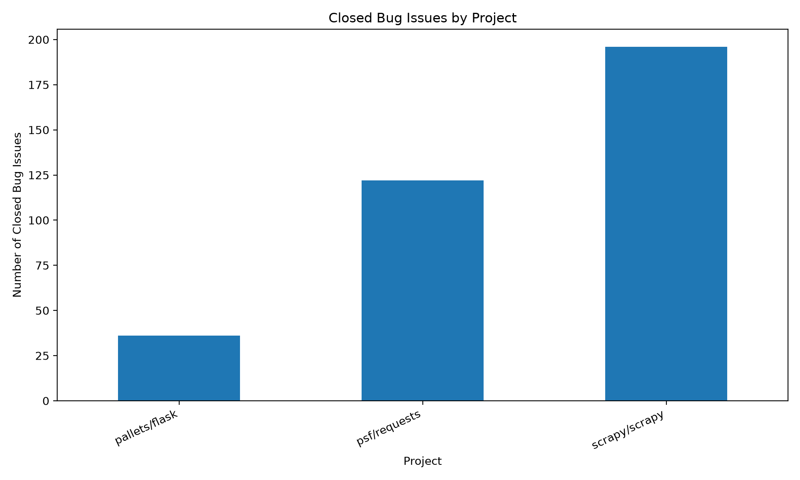
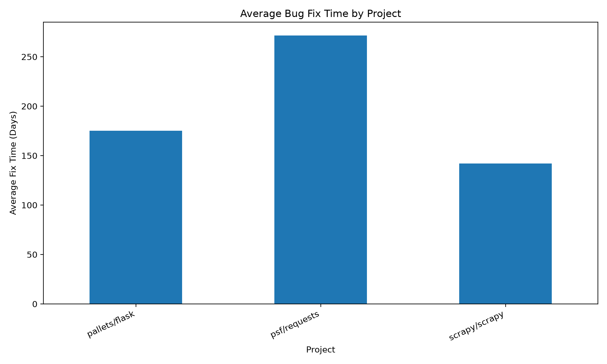
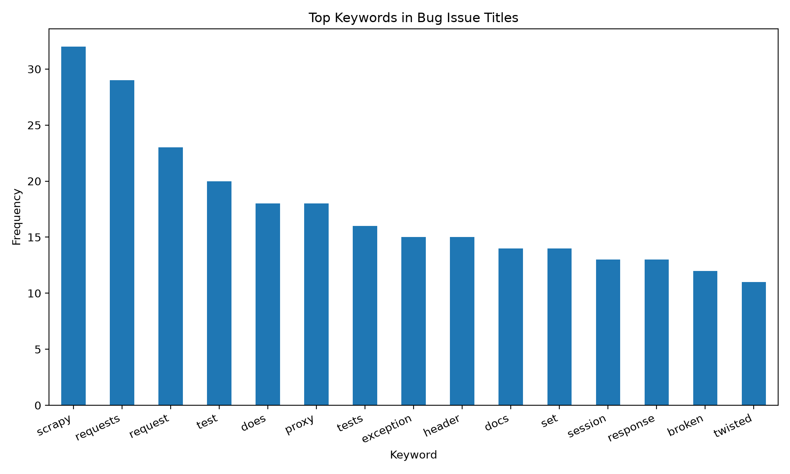
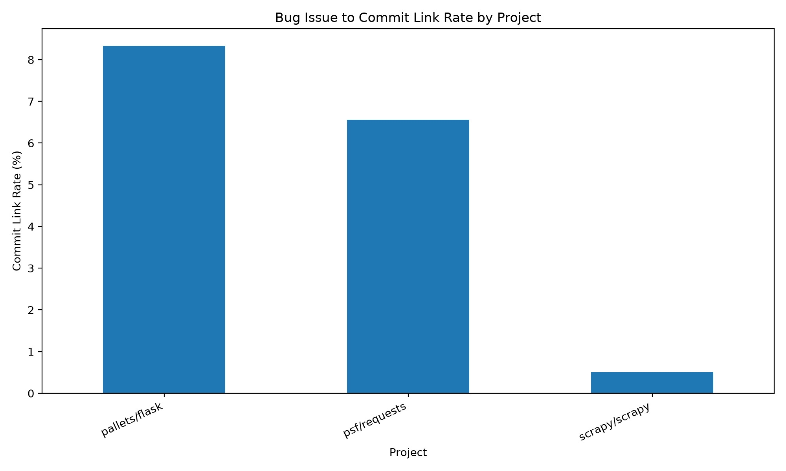
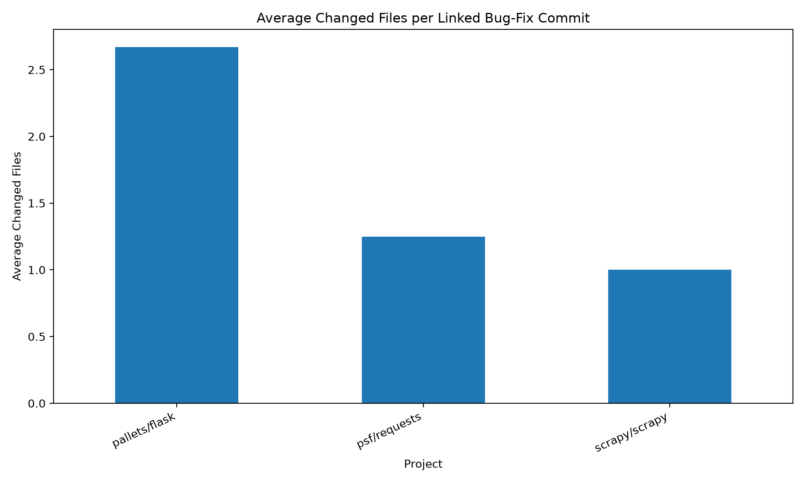
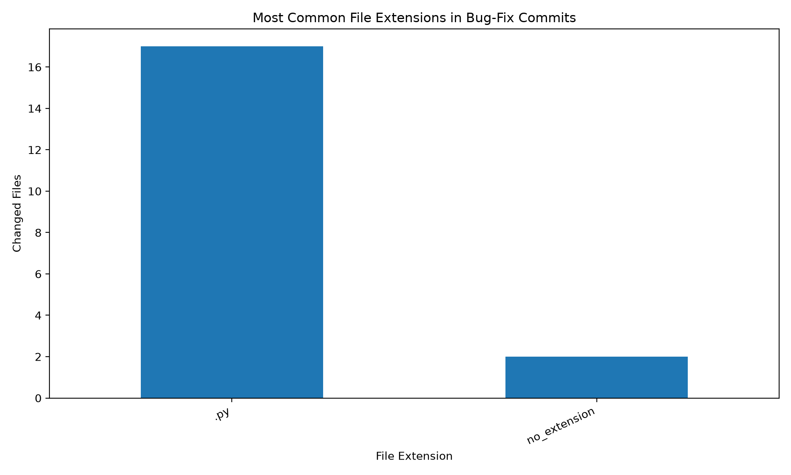

# GitHub Bug-Fix Mining Study

An empirical study of bug-fixing patterns, issue-to-commit links, and changed files in open-source Python repositories.

## Background

Bug fixing is an important activity in software maintenance. Open-source repositories on GitHub provide useful data for studying how bugs are reported, discussed, closed, and linked to code changes.

This project mines GitHub issue data from selected Python repositories and analyzes bug issue volume, issue closing time, common keywords in bug issue titles, issue-to-commit links, and changed files in linked bug-fix commits.

## Research Questions

* RQ1: How many closed bug issues are collected from each project?
* RQ2: How long does it usually take to close bug issues?
* RQ3: What keywords commonly appear in bug issue titles?
* RQ4: How often can closed bug issues be linked to commits?
* RQ5: What types of files are commonly changed in linked bug-fix commits?

## Project Structure

```text
github-bugfix-mining-study/
├── config/
│   └── repos.csv
├── data_collection/
│   ├── collect_bug_issues.py
│   ├── collect_issue_events.py
│   └── collect_commit_details.py
├── analysis/
│   ├── analyze_fix_time.py
│   ├── analyze_commit_links.py
│   └── generate_figures.py
├── dataset/
│   ├── raw/
│   │   ├── bug_issues_raw.csv
│   │   └── issue_events_raw.csv
│   └── processed/
│       ├── bug_issues_processed.csv
│       ├── project_summary.csv
│       ├── keyword_summary.csv
│       ├── issue_closure_events.csv
│       ├── bugfix_commits.csv
│       └── bugfix_commit_files.csv
├── results/
│   ├── tables/
│   │   ├── project_summary.csv
│   │   ├── keyword_summary.csv
│   │   ├── bugfix_commits.csv
│   │   ├── bug_issue_commit_links.csv
│   │   ├── project_summary_v2.csv
│   │   └── file_extension_summary.csv
│   └── figures/
│       ├── bug_issue_count_by_project.png
│       ├── avg_fix_time_by_project.png
│       ├── top_bug_keywords.png
│       ├── commit_link_rate_by_project.png
│       ├── avg_changed_files_by_project.png
│       └── file_extension_distribution.png
├── docs/
│   └── mini_report.md
├── README.md
├── requirements.txt
└── .env.example
```

## Dataset

The V2 dataset includes closed issues labeled as `bug` from three open-source Python repositories:

| Repository    | Language |
| ------------- | -------- |
| pallets/flask | Python   |
| psf/requests  | Python   |
| scrapy/scrapy | Python   |

Pull requests are filtered out from the issue dataset because GitHub returns pull requests as issue-like objects in the issues endpoint.

The collected issue data includes:

* repository owner
* repository name
* issue number
* issue title
* issue creation time
* issue closing time
* number of comments
* labels
* issue URL

In V2, the project also collects:

* issue events
* latest closed event
* linked commit ID, if available
* commit message
* commit date
* total changed lines
* additions
* deletions
* changed files
* changed file extensions

## Installation

Install dependencies:

```bash
pip install -r requirements.txt
```

Create a `.env` file based on `.env.example`:

```env
GITHUB_TOKEN=your_github_token_here
```

The GitHub token is used to access the GitHub REST API with a higher rate limit. Do not commit the real `.env` file to GitHub.

## How to Run

Collect closed bug issues:

```bash
python data_collection/collect_bug_issues.py
```

Analyze bug issue closing time and title keywords:

```bash
python analysis/analyze_fix_time.py
```

Collect issue events for each bug issue:

```bash
python data_collection/collect_issue_events.py
```

Collect commit details for commit-linked closed issues:

```bash
python data_collection/collect_commit_details.py
```

Analyze bug issue to commit links and changed files:

```bash
python analysis/analyze_commit_links.py
```

Generate result figures:

```bash
python analysis/generate_figures.py
```

Full V2 workflow:

```bash
python data_collection/collect_bug_issues.py
python analysis/analyze_fix_time.py
python data_collection/collect_issue_events.py
python data_collection/collect_commit_details.py
python analysis/analyze_commit_links.py
python analysis/generate_figures.py
```

## Results

The generated tables are saved in:

```text
results/tables/project_summary.csv
results/tables/keyword_summary.csv
results/tables/bugfix_commits.csv
results/tables/bug_issue_commit_links.csv
results/tables/project_summary_v2.csv
results/tables/file_extension_summary.csv
```

The generated figures are saved in:

```text
results/figures/bug_issue_count_by_project.png
results/figures/avg_fix_time_by_project.png
results/figures/top_bug_keywords.png
results/figures/commit_link_rate_by_project.png
results/figures/avg_changed_files_by_project.png
results/figures/file_extension_distribution.png
```

### Closed Bug Issues by Project



This figure shows the number of closed bug issues collected from each repository.

### Average Bug Fix Time by Project



This figure compares the average issue closing time across repositories.

### Top Keywords in Bug Issue Titles



This figure shows the most frequent keywords appearing in bug issue titles.

### Bug Issue to Commit Link Rate by Project



This figure shows the percentage of closed bug issues that can be linked to a closing commit through issue events.

### Average Changed Files per Linked Bug-Fix Commit



This figure shows how many files are changed on average in linked bug-fix commits.

### File Extension Distribution in Bug-Fix Commits



This figure shows the most common file extensions modified in linked bug-fix commits.

## V2 Update

V1 focused on closed bug issue collection, fix-time analysis, and title keyword analysis.

V2 extends the project by adding issue-to-commit and changed-file analysis. The project now collects issue events, extracts closed events, identifies commit-linked bug issues, collects commit details, and analyzes changed files in linked bug-fix commits.

The current version includes:

* closed bug issue collection
* pull request filtering
* issue closing time analysis
* bug issue title keyword analysis
* issue event collection
* issue-to-commit link extraction
* commit-level change analysis
* changed-file and file-extension analysis
* CSV result generation
* result visualization
* mini research-style report

## Current Limitations

* Only three repositories are analyzed in V2.
* Only issues labeled as `bug` are collected.
* Issue closing time may not exactly represent actual bug-fixing time.
* Different repositories may use labels differently.
* Pull requests are filtered out from the issue dataset.
* Some closed issues may not expose a linked commit identifier.
* Some bugs may be fixed through pull requests or multiple commits.
* Commit-level analysis may miss related changes if the issue is not directly linked to a commit.
* File extension analysis is simple and does not capture the semantic purpose of each changed file.
* The keyword analysis is simple and does not use advanced NLP.

## Future Work

* Expand the dataset to more repositories
* Collect pull request data related to bug issues
* Map bug issues to multiple commits
* Analyze changed files by source code, test code, documentation, and configuration
* Compare bug-fix commits with feature commits
* Add commit message classification
* Use NLP methods for issue title and description analysis
* Build a larger reproducible benchmark for bug-fix mining analysis

## Mini Report

A short project report is available in:

```text
docs/mini_report.md
```

## License

This project is licensed under the MIT License.
